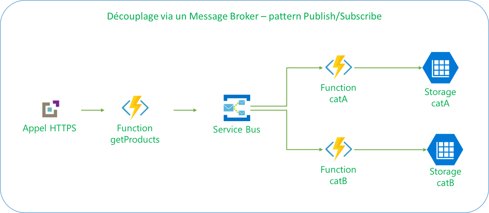

# AppInsightsWorkshop

## Azure Resource Group

Deploy the needed Azure resources into your subscription:

## Azure Functions

To deploy the azure functions, run the provided PowerShell scripts: DeployAlerting.ps1.

1. In your powershell editor, sign-in into your subscription thanks to the following command :
    > Login-AzureRMAccount
2. Select the desired subscription thanks to:
    > Select-AzureRMSubscription [subscriptionid / subscriptionName]
3. Execute the provided scripts by providing the following parameters:
    * rgName: Name of the resource group already deployed
    * functionAppName: Name of the function app that has been deployed ([prefixe][functionAppSuffixe])
    * zipFile: Path to the zip file that has been downloaded
    > .\DeployAlerting.ps1 -zipFile $zipFile -rgName $rgName -functionAppName $functionAppName